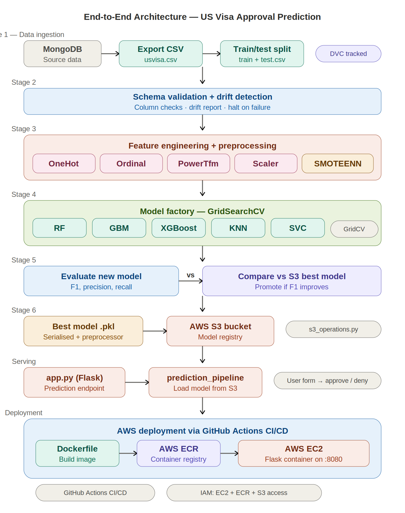

<!-- # US Visa Approval Prediction

This project aims to build a machine learning pipeline for predicting US visa approval. The pipeline includes stages from data ingestion to model deployment. The diagrams provided outline the workflow and components involved in the project.


1. ## Project Structure
<pre>
US Visa Approval Prediction/
├── components/
│   ├── data_ingestion.py
│   ├── data_validation.py
│   ├── data_transformation.py
│   ├── model_trainer.py
│   ├── model_evaluation.py
│   └── model_pusher.py
├── configuration/
│   ├── s3_operations.py
│   └── other_configurations.py
├── constant/
│   ├── constant_variables.py
├── entity/
│   ├── artifact_entity.py
│   └── config_entity.py
├── exception/
│   ├── exception_handling.py
├── logger/
│   ├── logger.py
├── pipeline/
│   ├── training_pipeline.py
│   └── prediction_pipeline.py
├── utils/
│   ├── main_utils.py
├── ml/
│   ├── feature_engineering.py
│   └── models.py
├── README.md
└── other_files_and_directories
</pre>
   
2. ## Data Ingestion
- **Config Setup**: Configure paths for data ingestion directory, feature store, training/testing files, and collection name.
- **Data Ingestion**: Connect to MongoDB to retrieve data and save it to a CSV file (usvisa.csv).
- **Export to Feature Store**: The ingested data is exported to a feature store.
- **Data Splitting**: Split the data into training and testing sets, saving them as train.csv and test.csv files respectively.
- **Artifacts**: Store data ingestion artifacts for tracking.


3. ## Data Validation
- **Config Setup**: Configure paths for validation directories, valid/invalid data files, and drift report file path.
- **Initiate Validation**: Read the ingested data and validate the number of columns, presence of numerical and categorical columns.
- **Status Check**: Ensure columns exist in both train and test datasets, and validate the data.
- **Dataset Drift**: Check for dataset drift and produce a validation report.


4. ## Data Transformation
- **Config Setup**: Configure paths for transformation directories, valid/invalid train/test files, and drift report file path.
- **Initiate Transformation**: Read the train and test data, drop unnecessary columns, and apply various encoders and transformers.
- **Column Transformation**: Use one-hot encoder, ordinal encoder, power transformer, and standard scaler.
- **Data Preparation**: Prepare train and test feature arrays, apply SMOTEENN for handling imbalanced data.
- **Save Artifacts**: Store transformed data and preprocessing objects as artifacts.


5. ## Model Training
- **Config Setup**: Configure paths for model training, model file paths, expected accuracy, and model config file.
- **Model Training**: Load transformed data, split into training and testing sets, and use a neural network model factory to train the model.
- **Model Evaluation**: Evaluate the trained model against the expected accuracy, save the best model if it meets criteria.


6. ## Model Evaluation
  - **Config Setup**: Configure paths for model evaluation, threshold score, bucket name, and S3 model key path.
- **Evaluate Models**: Compare the trained model with the best model stored in S3 based on F1 score, update if the new model performs better.
- **Save Artifacts**: Store model evaluation artifacts and responses.


7. ## Model Pusher
- **Config Setup**: Configure paths for model pusher, S3 model key path, and bucket name.
- **Push Model**: Save the best model to the specified S3 bucket for deployment.
- **Save Artifacts**: Store model pusher artifacts for tracking.


 -->


# 🛂 US Visa Approval Prediction — End-to-End ML Pipeline

[](https://python.org)
[](https://scikit-learn.org)
[](https://xgboost.readthedocs.io)
[](https://mongodb.com)
[](https://flask.palletsprojects.com)
[](https://docker.com)
[](https://aws.amazon.com)
[](LICENSE)

A **production-grade machine learning pipeline** that predicts whether a US visa application will be approved or denied. The system covers the full lifecycle — from MongoDB data ingestion through model training with automated hyperparameter tuning, to S3-backed model registry and containerised deployment on AWS EC2 via CI/CD.

---

## 📑 Table of Contents

- [Why This Project](#-why-this-project)
- [End-to-End Architecture](#-end-to-end-architecture)
- [Dataset](#-dataset)
- [ML Models & Approach](#-ml-models--approach)
- [Tech Stack](#-tech-stack)
- [Pipeline Stages](#-pipeline-stages)
- [Project Structure](#-project-structure)
- [Getting Started](#-getting-started)
- [Deployment](#-deployment)
- [Results & Metrics](#-results--metrics)
- [Future Improvements](#-future-improvements)

---

## 🎯 Why This Project

Visa approval prediction is a real-world classification problem with messy, imbalanced data, mixed feature types (categorical + numerical), and a need for explainability. This project doesn't just train a model — it builds the full **production ML system** around it: automated data validation with drift detection, a model factory that searches across multiple algorithms, an S3-backed model registry that only promotes models that beat the current best, and a Dockerised Flask app deployed to AWS. It's the kind of pipeline you'd actually run in production.

---

## 🏗 End-to-End Architecture



**Pipeline Flow:** MongoDB (source) → Data ingestion & train/test split → Schema validation & drift detection → Feature engineering (encoding, scaling, SMOTEENN) → Model factory with GridSearchCV across 5 algorithms → F1-based evaluation against S3 best model → Push winner to S3 → Flask prediction endpoint → Docker + AWS ECR/EC2 deployment via GitHub Actions.

---

## 📊 Dataset

The dataset contains US visa application records with features related to the employer, employee, and job characteristics.

| Attribute | Description |
|---|---|
| **case_id** | Unique identifier for each visa application |
| **continent** | Continent of the applicant's country of origin |
| **education_of_employee** | Education level of the employee |
| **has_job_experience** | Whether the employee has prior job experience |
| **requires_job_training** | Whether the job requires training |
| **no_of_employees** | Number of employees in the employer's organisation |
| **yr_of_estab** | Year the employer was established |
| **region_of_employment** | US region where the employee will work |
| **prevailing_wage** | Average wage for the job in the area |
| **unit_of_wage** | Unit of the prevailing wage (hourly, weekly, monthly, yearly) |
| **full_time_position** | Whether the position is full-time |
| **case_status** | **Target variable** — Certified (approved) or Denied |

**Class imbalance:** The dataset is imbalanced (more approvals than denials), which is handled in the transformation stage using SMOTEENN — a combination of SMOTE oversampling and Edited Nearest Neighbours undersampling.

---

## 🤖 ML Models & Approach

### Classification Approach

This is a **binary classification** problem: predict whether a visa application will be **Certified** (approved) or **Denied**.

### Model Factory

Rather than training a single model, the pipeline uses a **model factory** pattern with `GridSearchCV` to systematically search across multiple algorithms and hyperparameter combinations, selecting the best performer:

| Model | Type | Why Included |
|---|---|---|
| **Random Forest** | Bagging ensemble | Robust to overfitting, handles mixed feature types well |
| **Gradient Boosting** | Sequential boosting | Strong performance on tabular data with careful regularisation |
| **XGBoost** | Optimised gradient boosting | Fast training, built-in regularisation, handles imbalanced data |
| **KNN** | Instance-based | Non-parametric baseline, captures local decision boundaries |
| **SVC** | Kernel-based | Effective in high-dimensional spaces with clear margins |

### Feature Engineering Pipeline

The preprocessing pipeline (saved as a reusable artifact) applies transformations in order:

| Step | Technique | Purpose |
|---|---|---|
| **Categorical encoding** | OneHotEncoder | Convert nominal categories (continent, region) to binary features |
| **Ordinal encoding** | OrdinalEncoder | Encode ordered categories (education level) preserving rank |
| **Power transform** | PowerTransformer (Yeo-Johnson) | Normalise skewed numerical features (prevailing_wage, no_of_employees) |
| **Scaling** | StandardScaler | Zero-mean, unit-variance normalisation for distance-based models |
| **Resampling** | SMOTEENN | Address class imbalance — SMOTE oversamples minority + ENN cleans noisy majority |

### Evaluation Strategy

The pipeline uses **F1 score** as the primary metric (balancing precision and recall on an imbalanced dataset), with an automatic promotion gate: a new model only replaces the current production model in S3 if its F1 score is strictly higher.

### Key ML Libraries

- **scikit-learn** — Model training (RF, GBM, KNN, SVC), preprocessing (encoders, scalers, pipelines), GridSearchCV, evaluation metrics
- **XGBoost** — Gradient boosted trees with native handling of missing values
- **imbalanced-learn** — SMOTEENN for combined over/under-sampling
- **pandas / NumPy** — Data manipulation, feature engineering
- **Evidently** (or custom) — Dataset drift detection during validation

---

## 🛠 Tech Stack

### ML & Data

| Tool | Role |
|---|---|
| **Python 3.8+** | Core language |
| **scikit-learn** | Model training, preprocessing pipelines, GridSearchCV, metrics |
| **XGBoost** | Gradient boosted classifier |
| **imbalanced-learn** | SMOTEENN resampling for class imbalance |
| **pandas / NumPy** | Data manipulation, feature engineering |
| **MongoDB** | Source data store — visa application records |
| **pymongo** | Python driver for MongoDB connection |

### Application & Serving

| Tool | Role |
|---|---|
| **Flask** | Web application with prediction form endpoint (`app.py`) |
| **boto3** | AWS SDK — pull/push models to S3 |
| **dill / pickle** | Model and preprocessor serialisation |

### Infrastructure & DevOps

| Tool | Role |
|---|---|
| **AWS S3** | Model registry — stores best model + preprocessor artifacts |
| **AWS ECR** | Elastic Container Registry — Docker image storage |
| **AWS EC2** | Hosts the deployed containerised Flask application |
| **Docker** | Containerises the full application for reproducible deployment |
| **GitHub Actions** | CI/CD — build, push to ECR, deploy to EC2 on push to `main` |
| **Git / GitHub** | Version control |

---

## 🔄 Pipeline Stages

The ML pipeline runs as a sequence of modular, artifact-tracked stages. Each stage produces artifacts that feed the next.

### Stage 1: Data Ingestion

Connects to MongoDB, exports visa records to CSV, splits into train/test sets, and stores ingestion artifacts.


### Stage 2: Data Validation

Validates schema (column count, numerical/categorical column presence) against the expected schema. Runs dataset drift detection and produces a validation report. Pipeline halts if validation fails.


### Stage 3: Data Transformation

Applies the full preprocessing pipeline (OneHot → Ordinal → PowerTransform → StandardScaler → SMOTEENN), saves the fitted preprocessor object as an artifact for reuse in prediction.


### Stage 4: Model Training

Loads transformed features, runs the model factory (GridSearchCV across RF, GBM, XGBoost, KNN, SVC), selects the best model based on accuracy threshold, and saves the trained model artifact.


### Stage 5: Model Evaluation

Compares the newly trained model's F1 score against the current best model stored in S3. Only promotes the new model if it strictly outperforms the existing one.


### Stage 6: Model Pusher

Serialises the winning model + preprocessor and pushes them to the configured AWS S3 bucket, making them available for the prediction pipeline.


---

## 📁 Project Structure

```
US-Visa-Approval-Prediction/
├── config/                          # Configuration files (paths, S3 keys, thresholds)
├── flowcharts/                      # Pipeline stage diagrams (used in README)
├── notebook/                        # EDA and experimentation notebooks
├── us_visa/
│   ├── components/
│   │   ├── data_ingestion.py        # MongoDB → CSV → train/test split
│   │   ├── data_validation.py       # Schema checks + drift detection
│   │   ├── data_transformation.py   # Encoding, scaling, SMOTEENN
│   │   ├── model_trainer.py         # Model factory + GridSearchCV
│   │   ├── model_evaluation.py      # F1 comparison vs S3 best model
│   │   └── model_pusher.py          # Push best model to S3
│   ├── configuration/
│   │   └── s3_operations.py         # S3 upload/download utilities
│   ├── constants/                   # Path and config constants
│   ├── entity/
│   │   ├── config_entity.py         # Dataclass configs for each stage
│   │   └── artifact_entity.py       # Dataclass artifacts for each stage
│   ├── exception/                   # Custom exception handling
│   ├── logger/                      # Logging setup
│   ├── pipeline/
│   │   ├── training_pipeline.py     # Orchestrates all training stages
│   │   └── prediction_pipeline.py   # Loads model from S3 for inference
│   ├── utils/
│   │   └── main_utils.py            # Shared utility functions
│   └── ml/
│       ├── feature_engineering.py   # Feature transformers
│       └── models.py                # Model factory
├── assets/                          # Architecture diagram
├── app.py                           # Flask web application entry point
├── Dockerfile                       # Container build definition
├── DOCKER_AWS-DEPLOYMENT.md         # Detailed AWS deployment guide
├── FOLDER_STRUCTURE.md              # Project structure documentation
├── requirements.txt                 # Python dependencies
├── setup.py                         # Package setup
├── template.py                      # Project scaffolding script
├── test.py                          # Tests
└── README.md
```

---

## 🚀 Getting Started

### Prerequisites

- Python 3.8+
- MongoDB instance (local or Atlas) with visa dataset loaded
- AWS account with S3, ECR, and EC2 access (for deployment)
- Docker (for containerised deployment)

### Local Development

```bash
# 1. Clone the repo
git clone https://github.com/nishantrv/US-Visa-Approval-Prediction.git
cd US-Visa-Approval-Prediction

# 2. Create virtual environment
python -m venv venv
source venv/bin/activate  # Windows: venv\Scripts\activate

# 3. Install dependencies
pip install -r requirements.txt

# 4. Set environment variables
export MONGODB_URL="mongodb+srv://<username>:<password>@<cluster>.mongodb.net/"
export AWS_ACCESS_KEY_ID="<your-key>"
export AWS_SECRET_ACCESS_KEY="<your-secret>"
export AWS_DEFAULT_REGION="us-east-1"

# 5. Run the training pipeline
python -m us_visa.pipeline.training_pipeline

# 6. Launch the Flask app
python app.py
# App available at http://localhost:8080
```

### Docker

```bash
docker build -t us-visa-predictor .
docker run -p 8080:8080 \
  -e MONGODB_URL="<your-mongo-url>" \
  -e AWS_ACCESS_KEY_ID="<your-key>" \
  -e AWS_SECRET_ACCESS_KEY="<your-secret>" \
  us-visa-predictor
```

---

## ☁️ Deployment

The application is deployed to AWS using Docker, ECR, and EC2 via GitHub Actions CI/CD.

For the full step-by-step deployment guide, see **[DOCKER_AWS-DEPLOYMENT.md](DOCKER_AWS-DEPLOYMENT.md)**.

### Summary

```
Push to main → GitHub Actions → Docker build → Push to ECR → SSH into EC2 → Pull & run container
```

### AWS Resources Required

| Resource | Purpose |
|---|---|
| **S3 bucket** | Model registry (stores best model + preprocessor) |
| **ECR repository** | Docker image storage |
| **EC2 instance** | Runs the containerised Flask application |
| **IAM user** | Policies: `AmazonEC2ContainerRegistryFullAccess`, `AmazonEC2FullAccess`, `AmazonS3FullAccess` |

### GitHub Secrets

```
AWS_ACCESS_KEY_ID
AWS_SECRET_ACCESS_KEY
AWS_DEFAULT_REGION
AWS_ECR_LOGIN_URI
ECR_REPOSITORY_NAME
MONGODB_URL
```


## 🤝 Contributing

Contributions and feedback are welcome! Feel free to open an issue or submit a pull request.

---

## 📄 License

This project is licensed under the MIT License — see the [LICENSE](LICENSE) file for details.

---

**Built by [Nishant Ranjan Verma](https://github.com/nishantrv)** | Dublin, Ireland